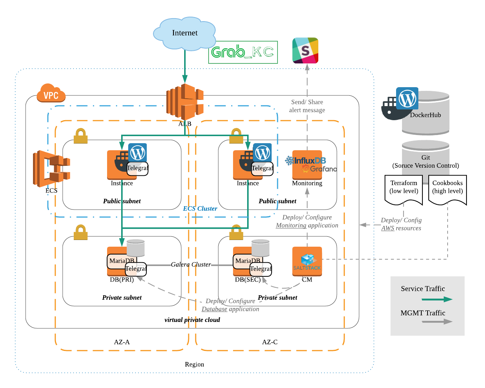

# Assignment of the Grab runbook 
Interviewed In 2018

## Summary
- Deploy AWS infrastructure from Terraform.
- Setup Wordpress application from docker on AWS ECS.
- Install Database(mariaDB) through SaltStack.
- Integrate monitoring system using InfluxDB, Telegraf and Grafana.
- Integrate Kapacitor with Slack for forwarding alert to OPs room.

## Service Architecture

## Introduction

I developed Terraform to deploy AWS low-level building block infrastructure such as VPC, ALB, and ECS. I also used Saltstack to develop application cookbooks as configuration management and role-based deployment to applications such as MariaDB, Galera clusters, and TIK stacks (Telegraf, InfluxDB, Kapacitor).

Designed VPC which has public/private subnets, and we can protect the application from maleficent traffic. The ECS cluster is on multi-AZ for HA and configured with ASG for application availability and elasticity. In addition, I developed a CM structure with scalability and reusable in order to serve a lot of GRAB services in the same cookbooks. In the monitoring system, I defined docker, system, and MariaDB monitoring metrics and make Grafana templates. lastly, I integrated the Kapacitor service to slack in order to get the alert messages in the Ops slack channel immediately.

## Implementation Guide(PDF)

<object data="https://github.com/cloudacode/runbook-interview/blob/main/grab-assignment-explained.pdf" type="application/pdf" width="700px" height="700px">
    <embed src="https://github.com/cloudacode/runbook-interview/blob/main/grab-assignment-explained.pdf">
        
This browser does not support PDFs. Please download the PDF to view it: <a href="https://github.com/cloudacode/runbook-interview/blob/main/grab-assignment-explained.pdf">Download PDF</a>.

    </embed>
</object>